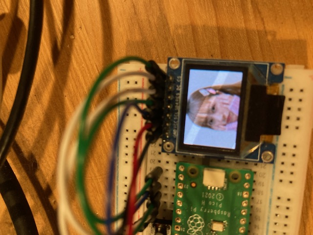

= カラーOLEDディスプレイ（SSD1331）をSPI経由で接続する

ssD1331のデータシートは file:///Users/dspace/Documents/Datasheets/SSD1331_1.2.pdf[ここ] にある。

== 配線情報

   * GPIO 17 (pin 22) Chip select -> SSD1331ボードのCS (Chip Select)
   * GPIO 18 (pin 24) SCK/spi0_sclk -> SSD1331ボードのSCL
   * GPIO 19 (pin 25) MOSI/spi0_tx -> SSD1331ボードのSDA (MOSI)
   * GPIO 22 (pin 26) -> SSD1331ボードのDC (Data/Command)
   * 3.3V OUT (pin 36) -> SSD1331ボードのVCC
   * GND (pin 38)  -> SSD1331ボードのGND

SPI port 0を使用する。電源は3.3V OUTピンから供給する。

== 実行結果

=== 1. 画像表示OK

* 24bit BMPから16bit RGB565に変換してヘッダーファイルとして作成するプログラムを作成
* SSD1331_REMAP_COLOR_DEPTH: 0x72 では上下逆さま
* SSD1331_REMAP_COLOR_DEPTH: 0x40 では横半分に圧縮
* SSD1331_REMAP_COLOR_DEPTH: 0x60 で正常
   ** [7:6]=01: 65K color format
   ** [5]=1: Enable COM Spilit Odd Even
   ** [4]=0: Scan from COM0 tom COM[N-1]
   ** [3]=0: Disable left-right swapping on COM
   ** [2]=0: RGB
   ** [1]=0: RAM Column 0 to 95 to Pin Seg(SA,SB,SC) 0 to 95
   ** [0]=0: Horizontal address increment
* 文字出力が反転するようになった
   ** 元画像のbmp形式は画像データが上下反転で格納される仕様であった
   ** `convert -flip` で元画像を上限反転
   ** SSD1331_REMAP_COLOR_DEPTHを0x72に戻すと画像も文字出力も正常になった

=== 2. フォント表示OK

* フォントは `src-examples/i2c/ssd1306_i2c/ssd1306_font.h`を流用
* このフォントはSSD1306のバッファの持ち方により左に90度釜向いているので右に90度回転するプログラムを作成
* できたフォントを少しだけ修正

link:refs/ssd1306_font.adoc[フォントについて]

image::font_ok.jpeg[フォント表示]

=== 3. スクロールOK

=== 4. 変転表示OK

=== 5. ライン描画OK

== データ送信に `spi_write16_blocking` を使用

unit16_t[]を書き出すための関数があることを発見してデータバッファをuint16_t[]として書き直した。
修正点は次の5点。

* 画像データをuint16_tの配列で書き出すようimage_to_hex.cを変更
* バッファサイズをuint16_tの個数に変更
* colorのuint8_t[2]への分解をやめる
* send_data()でspi_write_blocking()の代わりにspi_write16_blocking()を使用
* send_cmd(), send_data()の冒頭でspi_set_format()で送信データのビット数を変更

なお、この変更で文字色の白が黄色になる問題が解決した。
