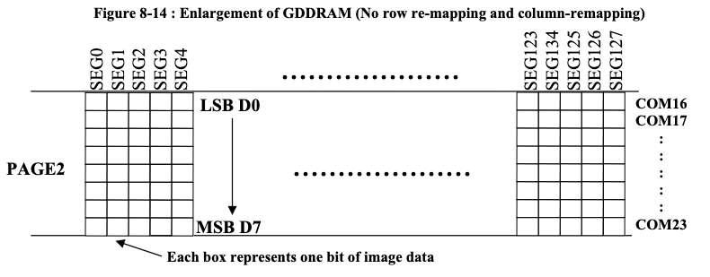

= フォントについて

== SSD1306_font.h

=== 元ファイル

-----
0x1e, 0x28, 0x48, 0x88, 0x48, 0x28, 0x1e, 0x00,  // A

---xxxx-
--x-x---
-x--x---
x---x---
-x--x---
--x-x---
---xxxx-
--------
-----

=== 使用時（左右反転）

-----
0x78, 0x14, 0x12, 0x11, 0x12, 0x14, 0x78, 0x00

-XXXX---
---X-X--
---X--X-
---X---X
---X--X-
---X-X--
-XXXX---
--------
-----

=== 傾きの理由

* 行は8行ごとにページで管理される
* ページ内の各バイトは各行の同一桁のピクセルを表す
* バイト内のピクセルはLSB(D0)からMSB(D7)に行に割り当てられる
* したがって左右反転したフォントは表示すると次のようになる

-----
---X----
--X-X---
-X---X--
X-----X-
XXXXXXX-
X-----X-
X-----X-
--------
-----

== SSD1331で使用するフォント

* SSD1331では1ピクセルを16bit RGB565の2バイトで表現する
* したがって、元ファイルを左右に傾ける必要はない
* SSD1306_fontを右に90度回転
* 文字形を一部修正

-----
0x10, 0x28, 0x44, 0x82, 0xfe, 0x82, 0x82, 0x00,

---X----
--X-X---
-X---X--
X-----X-
XXXXXXX-
X-----X-
X-----X-
--------

0xfe, 0x82, 0x82, 0xfC, 0x82, 0x82, 0xfe, 0x00,

XXXXXX--
X-----X-
X-----X-
XXXXXX--
X-----X-
X-----X-
XXXXXX--
--------

0x7c, 0x82, 0x80, 0x80, 0x80, 0x82, 0x7c, 0x00,

-XXXXX--
X-----X-
X-------
X-------
X-------
X-----X-
-XXXXX--
--------

0xfc, 0x82, 0x82, 0x82, 0x82, 0x82, 0xfC, 0x00,

XXXXXX--
X-----X-
X-----X-
X-----X-
X-----X-
XXXXXX--
--------

0xfe, 0x80, 0x80, 0xfe, 0x80, 0x80, 0xfe, 0x00

XXXXXXX-
X-------
X-------
XXXXXXX-
X-------
X-------
XXXXXXX-
--------

0xfe, 0x80, 0x80, 0xf8, 0x80, 0x80, 0x80, 0x00

XXXXXXX-
X-------
X-------
XXXXX---
X-------
X-------
X-------
--------

0xfe, 0x82, 0x80, 0x80, 0x8e, 0x82, 0xfe, 0x00

XXXXXXX-
X-----X-
X-------
X-------
X---XXX-
X-----X-
XXXXXXX-
--------

0x82, 0x82, 0x82, 0xfe, 0x82, 0x82, 0x82, 0x00

X-----X-
X-----X-
X-----X-
XXXXXXX-
X-----X-
X-----X-
X-----X-

0x38, 0x10, 0x10, 0x10, 0x10, 0x10, 0x38, 0x00,

--XXX---
---X----
---X----
---X----
---X----
---X----
--XXX---
--------

0x38, 0x10, 0x10, 0x10, 0x10, 0x90, 0x60, 0x00

--XXX---
---X----
---X----
---X----
---X----
X--X----
-XX-----
--------

0x42, 0x44, 0x48, 0x70, 0x48, 0x44, 0x42, 0x00,     // K

-X----X-
-X---X--
-X--X---
-XXX----
-X--X---
-X---X--
-X----X-
--------

0x80, 0x80, 0x80, 0x80, 0x80, 0x80, 0xfe, 0x00,     // L

X-------
X-------
X-------
X-------
X-------
X-------
XXXXXXX-
--------

0x82, 0xc6, 0xaa, 0x92, 0x82, 0x82, 0x82, 0x00,     // M

X-----X-
XX---XX-
X-X-X-X-
X--X--X-
X-----X-
X-----X-
X-----X-
--------

0x82, 0xc2, 0xa2, 0x92, 0x8a, 0x86, 0x82, 0x00,     // N

X-----X-
XX----X-
X-X---X-
X--X--X-
X---X-X-
X----XX-
X-----X-
--------

0x7c, 0x82, 0x82, 0x82, 0x82, 0x82, 0x7c, 0x00,     // O

-XXXXX--
X-----X-
X-----X-
X-----X-
X-----X-
X-----X-
-XXXXX--
--------

0xfc, 0x82, 0x82, 0xfc, 0x80, 0x80, 0x80, 0x00,     // P

XXXXXX--
X-----X-
X-----X-
XXXXXX--
X-------
X-------
X-------
--------

0x7c, 0x82, 0x82, 0x92, 0x8a, 0x86, 0x7e, 0x00,     // Q

-xxxxx--
x-----x-
x-----x-
x--x--x-
x---x-x-
x----xx-
-xxxxxx-
--------

0xfc, 0x82, 0x82, 0xfc, 0x88, 0x84, 0x82, 0x00,     // R

xxxxxx--
x-----x-
x-----x-
xxxxxx--
x---x---
x----x--
x-----x-
--------

0x78, 0x84, 0x80, 0x78, 0x04, 0x84, 0x78, 0x00,     // S

-xxxx---
x----X--
x-------
-xxxx---
-----x--
x----x--
-xxxx---
--------

0xfe, 0x10, 0x10, 0x10, 0x10, 0x10, 0x10, 0x00,     // T

xxxxxxx-
---x----
---x----
---x----
---x----
---x----
---x----
--------

0x82, 0x82, 0x82, 0x82, 0x82, 0x82, 0x7c, 0x00,     // U

x-----x-
x-----x-
x-----x-
x-----x-
x-----x-
x-----x-
-xxxxx--

0x82, 0x82, 0x82, 0x82, 0x44, 0x28, 0x10, 0x00,     // V

x-----x-
x-----x-
x-----x-
x-----x-
-x---x--
--x-x---
---x----
--------

0x82, 0x82, 0x82, 0x92, 0xaa, 0xc6, 0x82, 0x00,     // w

x-----x-
x-----x-
x-----x-
x--x--x-
x-x-x-x-
xx---xx-
x-----x-
--------

0x42, 0x24, 0x18, 0x18, 0x18, 0x24, 0x42, 0x00,     // X

-x----x-
--x--x--
---xx---
---xx---
---xx---
--x--x--
-x----x-
--------

0x82, 0x44, 0x28, 0x10, 0x10, 0x10, 0x10, 0x00,     // Y

x-----x-
-x---x--
--x-x---
---x----
---x----
---x----
---x----
--------

0xfe, 0x04, 0x08, 0x10, 0x20, 0x40, 0xfe, 0x00,     // Z

xxxxxxx-
-----x--
----x---
---x----
--x-----
-x------
xxxxxxx-
--------

0x7c, 0x86, 0x8a, 0x92, 0xa2, 0xc2, 0x7c, 0x00,     // 0

-xxxxx--
x----xx-
x---x-x-
x--x--x-
x-x---x-
xx----x-
-xxxxx--
--------
0x10, 0x30, 0x10, 0x10, 0x10, 0x10, 0x38, 0x00,     // 1

---x----
--xx----
---x----
---x----
---x----
---x----
--xxx---
--------

0x78, 0x04, 0x04, 0x78, 0x80, 0x80, 0xfc, 0x00,     // 2

-xxxx---
x----x--
-----x--
-xxxx---
x-------
x-------
xxxxxx--

0xfc, 0x02, 0x02, 0x7c, 0x02, 0x02, 0xfc, 0x00,     // 3

xxxxxx--
------x-
------x-
-xxxxx--
------x-
------x-
xxxxxx--
--------

0x08, 0x18, 0x28, 0x48, 0x88, 0xfe, 0x08, 0x00,     // 4

----x---
---xx---
--x-x---
-x--x---
x---x---
xxxxxxx-
----x---
--------

0xfc, 0x80, 0x80, 0xfc, 0x02, 0x02, 0x7c, 0x00,     // 5

xxxxxx--
x-------
x-------
xxxxxx--
------x-
------x-
xxxxxx--
--------

0x7c, 0x80, 0x80, 0xfc, 0x82, 0x82, 0x7c, 0x00,     // 6

-xxxxx--
x-------
x-------
xxxxxx--
x-----x-
x-----x-
-xxxxx--
--------

0xfe, 0x02, 0x04, 0x08, 0x10, 0x20, 0x20, 0x00,     // 7

xxxxxxx-
------x-
-----x--
----x---
---x----
--x-----
--x-----
--------

0x7c, 0x82, 0x82, 0x7c, 0x82, 0x82, 0x7c, 0x00,     // 8

-xxxxx--
x-----x-
x-----x-
-xxxxx--
x-----x-
x-----x-
-xxxxx--
--------

0x7c, 0x82, 0x82, 0x7e, 0x02, 0x04, 0x08, 0x00,     // 9

-xxxxx--
x-----x-
x-----x-
-xxxxxx-
------x-
-----x--
----x---
--------

0x00, 0x00, 0x00, 0x00, 0x00, 0x60, 0x60, 0x00      // .

--------
--------
--------
--------
--------
-xx-----
-xx-----
--------

0x00, 0x30, 0x30, 0x00, 0x30, 0x30, 0x00, 0x00      // :

--------
--xx----
--xx----
--------
--xx----
--xx----
--------
--------

-----
